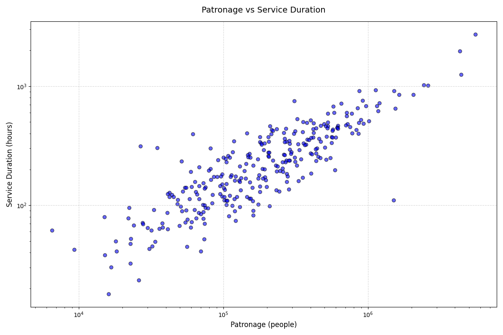

I believe it's important to regularly examine the productivity of all bus routes, making resource-effective changes to create a more useful network for more people. [Victoria's Bus Plan (2021)](https://www.vic.gov.au/sites/default/files/2023-09/victorias-bus-plan-bus-reform-roadmap.pdf) agrees with this.

> 6. Deliver better value for money – ensuring value for money and continual service improvement under existing and new contracts with bus operators, manufacturers and infrastructure partners.

I set out to see which Bus Routes are under-performing relative to the resources provided, as well as which routes require more resources to sustain demand.

# Methodology

It's important to normalize patronage data per route in order to make comparisons. I decided to test patronage data against the following three metrics to see which has the strongest correlation. 

1. Service Duration: The total number of timetabled service hours
2. Service Distance: The total timetabled distance covered
3. Service Stops: The number of timetabled non-unique stops served

I used a normal week in February 2026 without public holidays, and summated service hours for each direction.

The following is a simplification of loading the GTFS data using `gtfs-kit`, which was later used to calculate the three metrics. 

```python file="gtfs-kit.py"
import gtfs-kit as gk
feed = gk.read_feed("C:/Users/Administrator/Desktop/PT/gtfs/4/google_transit.zip", dist_units="m")
dates = [str(d) for d in range(20260202, 20260202 + 7)]
trip_stats = feed.compute_trip_stats()
route_stats = gk.routes.compute_route_stats(feed, dates, trip_stats
```

I then used `statsmodels.api` on the three metrics, deploying an Ordinary Least Squares Regression to find the R-squared and F-statistic values.

```python file="statsmodels.py"
import statsmodels.api as sm
X = df['service_hours']
y = df['patronage']
X = sm.add_constant(X)
model = sm.OLS(y, X, missing='drop').fit()
print(model.summary())
```

# Findings


| Independent Variable | **R-squared Value** | **F-statistic Value** | **P value** |
| -------------------- | ------------------- | --------------------- | ----------- |
| 1. Service Duration | 0.797 | 1314 | <0.001 |
| 2. Service Distance | 0.750 | 1005 | <0.001 |
| 3. Service Stops | 0.762 | 1086 | <0.001 |


The number of service hours of a route has the strongest association with patronage. Therefore, I will use Service Duration as the independent variable in the following visual analysis. 


Routes 246 (36.9 people/hr), 402 (31.8 people/hr), 733 (45.6 people/hr), 737 (36.3 people/hr), and 767 (32.6 people/hr) are over-performing other non SmartBus routes with high level of service. The [733 and 767](https://www.premier.vic.gov.au/community-gets-board-extra-bus-services) both got upgraded in 2022, and the 246 and 402 runs an elite 10-minute off-peak frequency. However the 737 is due for an upgrade, running a worse than 30 minute off-peak frequency. 

Meanwhile, 788 stands alone as the most underperforming from the top 50 most served routes, running over 50km and taking 100+ minutes with a frequency of between 30-40 minutes over a solid span. It has a very poor patronage of 7.9 people per service hour which is less than half of the mean of all routes. 


| **Route** | **Description** | **Patronage ('000)** | **Service Hours** | **Patronage Per Service Hour** |
| --------- | ---------------------------------------------- | -------------------- | ----------------- | ------------------------------ |
| 903 | Mordialloc SC - Altona Station | 5548.0 | 2725.0 | 39.0 |
| 901 | Melbourne Airport - Frankston | 4329.6 | 1965.8 | 42.2 |
| 902 | Chelsea Station - Airport West Shopping Centre | 4418.0 | 1250.7 | 67.8 |
| 907 | City (Spencer Street) - Mitcham | 2436.2 | 1022.2 | 45.7 |
| 703 | Blackburn - Middle Brighton | 2603.0 | 1018.0 | 49.0 |


The table above displays the 5 routes with the greatest number of service hours. The three orbitals (901/902/903) are the most resource intensive routes, however their patronage is proportional to the number of service hours run. The 902 in particular is super productive for a 78 kilometre journey. 

The 703, 900, 907, and 906 follow which are all SmartBuses. It's clear that the SmartBus program has been a decade-long success by creating new high-performing routes, however their extreme length has proved tricky to update as demand has increased over time. Patronage levels on the three orbitals in 2023 are within 5% of 2019 levels of patronage, almost returning to pre-COVID displaying the demand for reliable travel remains.


The patronage per hour histogram provides a mean of 18.3 passengers/hour. The Route 601 stands as an outlier with a historic 261 passengers per hour. I suspect this is the result of a variety of factors, including limited stops, an average speed of 29km/h, lengthy bus lanes, high demand from students, and possible low fare avoidance due to most connecting with rail.



Over 80 routes have a patronage per service hour at less than half of the average, including the 788 as aforementioned. This is also seen in the histogram, with an IQR of 9.5 to 24.2 passengers/hour. While there are other goals for routes such as maximizing coverage, low patronage is a key indicator that the route may be underperforming.

# So What?

By isolating service hours as one variable, patronage data assists in evaluating the performance of a route. However, there is more nuance to this that requires data that isn't currently publicly available. 

Is an off-peak and weekend patronage drop proportional to the service hours provided? Moreover, how have recent upgrades in service hours affect patronage, and can the discussed model accurately predict said change? And looking at the other two metrics discussed, can service distance or number of stops become more useful metrics by looking at local area coverage and unique coverage?